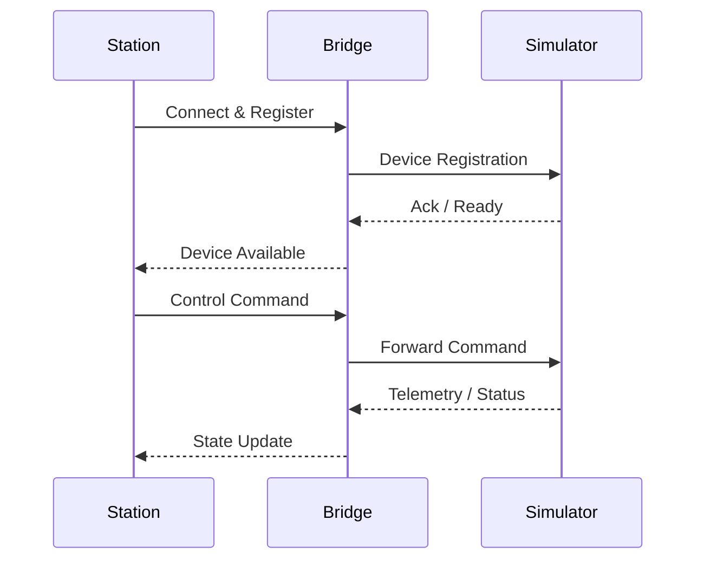

🦅 Harpia
=========

**Harpia** is a personal engineering project focused on the **design of a distributed command-and-control system** for remote vehicles and simulators.

Inspired by the harpy eagle — known for its vision, reach, and precision — the project explores how a single controller can securely and reliably coordinate multiple remote devices over a network.
This repository represents an **active system design**, not a finished product.

* * *

🎯 Goals
--------

*   Design a scalable architecture for remote control of multiple vehicles
*   Explore communication patterns used in industrial, robotic, and autonomous systems
*   Practice protocol design, distributed systems, and software architecture
*   Serve as a **portfolio project** focused on engineering decisions rather than UI polish
   
* * *

🧠 What This Project Demonstrates
---------------------------------

*   Distributed system design (controller ↔ server ↔ device)
*   Custom lightweight networking protocols
*   Clear separation of responsibilities between system components
*   Incremental architecture evolution driven by real constraints
*   Engineering-first thinking over feature-driven development
    
* * *

🏗️ High-Level Architecture
---------------------------

Harpia is organized around three main components:
*   **Station (Controller)**  
    The pilot application responsible for sending commands and visualizing device state.
    
*   **Bridge (Server / Gateway)**  
    A central server that manages connections, device ownership, state, and message routing.
    
*   **Simulator (Device)**  
    A simulated vehicle that executes commands and streams telemetry data.
    

### Communication Overview

*   Station ↔ Bridge: **SignalR** (high-level, bidirectional control)
    
*   Bridge ↔ Simulator: **TCP** (low-level, deterministic messaging)
    

* * *

🔁 High-Level Sequence Flow
---------------------------

The diagram below shows a **simplified control flow**, intentionally omitting protocol and payload details.

This flow represents the conceptual contract between components, not a fixed implementation.

* * *

📡 Protocol Stack (Overview Only)
---------------------------------

Harpia uses a **custom lightweight protocol stack** designed for constrained and autonomous systems:
*   **SLSP (Secure Light Session Protocol)**  
    Handles framing, session control, and optional authenticated encryption.
    
*   **ALMP (Autonomous Light Messaging Protocol)**  
    Handles command-and-control semantics using compact, dynamic payloads.
    
The protocols are inspired by industrial and autonomous standards such as **JAUS**, **MODBUS**, and **DLMS/COSEM**.
📘 Detailed protocol documentation lives outside this README:
*   `docs/protocols/overview.md`
*   `docs/protocols/slsp.md`
*   `docs/protocols/almp.md`

* * *

🛣️ Roadmap
-----------

This project is developed in **clear, incremental phases**:
*   **Phase 1 – Protocol & Communication**  
    Define message framing, command taxonomy, and transport boundaries.
    
*   **Phase 2 – Controller User Interface**  
    A pilot-facing UI for device discovery, control, and monitoring.
    
*   **Phase 3 – Simulator Interface**  
    A visual environment representing vehicles and terrain.
    
*   **Phase 4 – Robotics & Control Algorithms**  
    Path planning, steering logic, and assisted control (e.g. LQR).
    
*   **Phase 5 – Map & World Generation**  
    Terrain, routing data, and optional real-world map integration.
    
*   **Phase 6 – Physical RC Vehicle Integration (State of the Art)**  
    Experimental and long-term research goal.
    
Later phases are **explicitly exploratory** and may never be fully implemented.

* * *

📌 Project Status
-----------------

Harpia is currently in the **system design and refinement phase**.
*   Console-based components are used as development and validation tools
*   UI frameworks and simulation engines are evaluated but not locked in
*   Requirements and architecture are expected to evolve
    
This repository prioritizes **clarity of design over completeness**.

* * *

📜 License
----------

MIT License — free to use, modify, and learn from.

* * *

🤝 Notes
--------

This is a personal engineering project. Feedback, architectural discussions, and design critiques are welcome.
